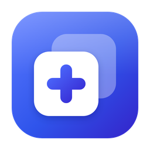
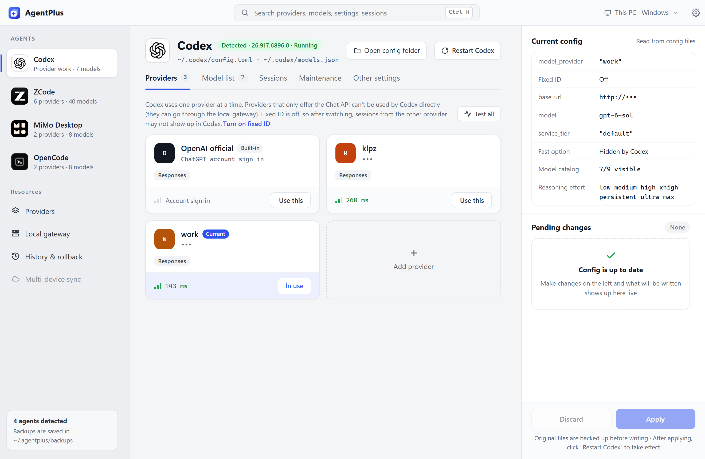
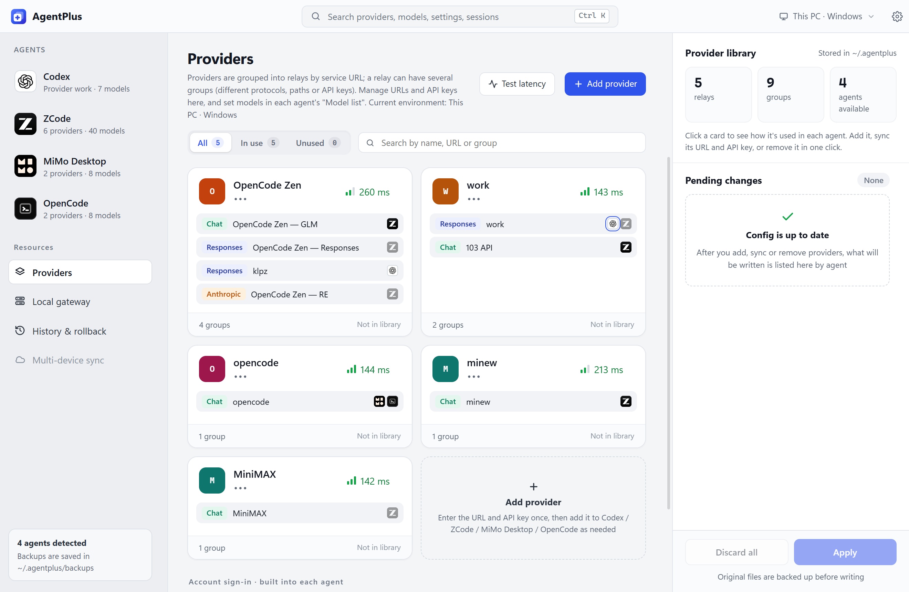
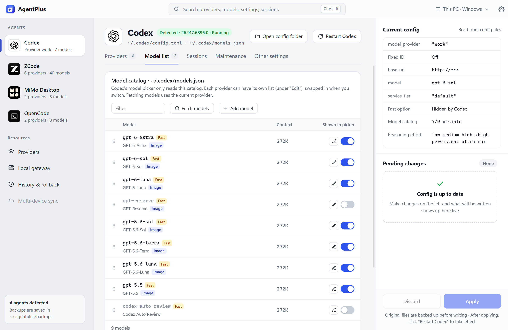
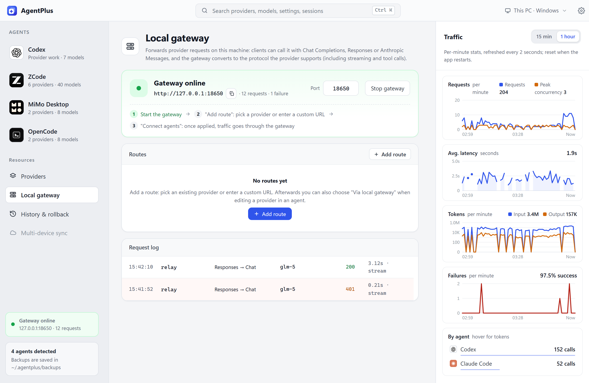

<div align="center">



# AgentPlus

**All-in-one management of providers and model lists for all your AI coding agents**

Codex · Claude Code · OpenCode · ZCode · MiMo Desktop · Gemini CLI · Qwen Code · Kimi Code and 7 more

[](https://github.com/cnklpz/AgentPlus/releases/latest)    [](LICENSE)

[简体中文](README.md) | English

<picture>
  <source media="(prefers-color-scheme: dark)" srcset="docs/images/codex-dark-en.png">
  
</picture>

</div>

## Why AgentPlus

Every agent stores its configuration differently: Codex uses TOML plus `models.json`, OpenCode uses JSONC, Claude Code uses environment variables in `settings.json`…
Switching to another relay means editing URLs, pasting keys and fixing model lists in several files.

AgentPlus reads all of them and puts them in one window: **maintain a provider once and push it to any agent**, then decide per agent which models show up in its picker.
Every change is previewed as a diff and backed up before it is written, so you can always roll back.

> AgentPlus manages *which providers exist and which models are in the picker*. It **does not choose the model you are using**; you still do that in each agent.

## Screenshots

<table>
  <tr>
    <td width="50%"><p align="center"><b>Provider library</b>: grouped by relay, showing which agents use each group</p></td>
    <td width="50%"><p align="center"><b>Model list</b>: choose per agent which models appear in the picker</p></td>
  </tr>
  <tr>
    <td colspan="2"><p align="center"><b>Local gateway</b>: converts between three protocols, with live traffic, latency and failure charts</p></td>
  </tr>
</table>

## Features

<table>
  <tr>
    <td width="50%" valign="top">🗂️ <b>Provider library</b><br>Keep all providers in one place and push them to the agents you pick. 19 templates for vendors and coding plans only need an API key</td>
    <td width="50%" valign="top">📋 <b>Model lists</b><br>Choose per agent which models appear in its picker, fetch a provider's model list, set fields such as the context window</td>
  </tr>
  <tr>
    <td width="50%" valign="top">🔍 <b>Preview, then apply</b><br>Changes go into a pending list where you review each diff before writing; then restart the agent in one click</td>
    <td width="50%" valign="top">⏪ <b>History and rollback</b><br>Original files are backed up to <code>~/.agentplus/backups/</code> before every write and can be restored in one click</td>
  </tr>
  <tr>
    <td width="50%" valign="top">🔀 <b>Local gateway</b><br>Converts between OpenAI Chat, OpenAI Responses and Anthropic Messages on the fly, streaming and tool calls included, with an error breaker</td>
    <td width="50%" valign="top">⚡ <b>Latency and tests</b><br>Measure latency, or send one small real request to check the URL, key and model</td>
  </tr>
  <tr>
    <td width="50%" valign="top">🐧 <b>WSL</b><br>Switch the target environment between Windows and WSL distros; the provider library is shared</td>
    <td width="50%" valign="top">🙈 <b>Privacy mode</b><br><code>Ctrl+Shift+H</code> masks keys, hosts and user names and blurs conversation titles, for screenshots and screen sharing</td>
  </tr>
  <tr>
    <td width="50%" valign="top">⌨️ <b>Command palette</b><br><code>Ctrl+K</code> searches providers, models, settings and sessions</td>
    <td width="50%" valign="top">📌 <b>Tray</b><br>Closing the window can minimize it to the tray while the local gateway keeps running</td>
  </tr>
  <tr>
    <td width="50%" valign="top">🔄 <b>In-app updates</b><br>Checks GitHub Releases and verifies the installer's signature before installing</td>
    <td width="50%" valign="top">🌐 <b>Chinese and English</b><br>The UI follows the system language by default</td>
  </tr>
</table>

## Supported systems

| System | Status | Notes |
|---|---|---|
| Windows 11 (x64) | ✅ Supported | Main platform |
| Windows 10 (x64) | ✅ Supported | Needs WebView2; the installer adds it |
| WSL distros | ✅ Supported | As a target: manage Codex CLI, OpenCode and others inside WSL |
| macOS 11+ (Apple silicon / Intel) | 🧪 Experimental | Finds desktop apps in /Applications and CLIs on PATH, and restarts desktop apps. Not yet tested much on real Macs; feedback welcome |
| Linux | ⏳ Not yet | Compiles, but isn't packaged |

## Download

Get it from [Releases](https://github.com/cnklpz/AgentPlus/releases/latest):

- **Windows**: `AgentPlus_<version>_x64-setup.exe`. Run it to install. The installer is not code-signed, so SmartScreen may say "Windows protected your PC" on first run. Click "More info → Run anyway".
- **macOS**: `AgentPlus_<version>_aarch64.dmg` for Apple silicon, `AgentPlus_<version>_x64.dmg` for Intel. Open it and drag AgentPlus into Applications. The app isn't notarized by Apple, so macOS blocks the first launch: click "Open Anyway" in System Settings → Privacy & Security. If it says the app is damaged, run `xattr -cr /Applications/AgentPlus.app` in Terminal and open it again.

**Updates**: AgentPlus checks for a new version at startup; when there is one, a small dot appears on the Settings button in the top-right corner.
Open Settings → General → About to read the release notes and click "Download and install". AgentPlus verifies the signature, installs the update and reopens. You can turn off the startup check in the same place.

## Supported agents

Agents that aren't installed are hidden. For agents installed in a non-default location, set the config folder in Settings → Agent detection.

| Agent | Configuration it manages |
|---|---|
| **Codex** (desktop + CLI) | `~/.codex/config.toml`, `models.json` |
| **Claude Code** | `env` in `~/.claude/settings.json` |
| **OpenCode** | `~/.config/opencode/opencode.json(c)`, plus `opencode.json` in projects |
| **MiMo Desktop** | `~/.config/mimocode/mimocode.jsonc` |
| **ZCode** | `~/.zcode/v2/provider_config.json` |
| **Gemini CLI** | `~/.gemini/settings.json` |
| **Qwen Code** | `~/.qwen/settings.json` |
| **Kimi Code** | `~/.kimi-code/config.toml` |
| **Kilo Code** | `~/.config/kilo/kilo.json(c)` |
| **CodeBuddy** | `~/.codebuddy/models.json` |
| **Droid** (Factory) | `~/.factory/settings.json` |
| **Hermes** | `config.yaml` under HERMES_HOME |
| **pi** | `~/.pi/agent/models.json` |
| **OpenClaw** | `~/.openclaw/openclaw.json` |
| **Trae** | Detection only: custom models live in the account's cloud storage; AgentPlus shows the manual steps |

### What's special for each agent

<details open>
<summary><b>Codex</b>: sessions, fixed provider ID, official model catalog</summary>

- **Fixed provider ID**: switching providers only rewrites one table, so past sessions don't vanish from Codex's lists when you change relays
- **A model list per provider**, swapped in automatically when you switch
- **Sessions**: browse every session, see why one is hidden in Codex, move sessions to another provider (with undo), copy the `codex resume` command
- **Maintenance**: health check (database, missing files, provider mismatches, log size…) and safe cleanup, with a backup first
- **Fetch the official model catalog**: sign in with ChatGPT once and import the official model list into your catalog
- **UI enhancements**: patches such as Fast mode and full model names, applied when AgentPlus restarts Codex
- Restart the Codex desktop app from AgentPlus

</details>

<details>
<summary><b>Claude Code</b>: provider profiles and model roles</summary>

- Each provider is a profile; switching writes it into the `env` block of `settings.json`. A relay you set up by hand is detected and can be adopted
- **Model roles**: pick the model for default, Opus, Sonnet, Haiku and subagents separately
- Anthropic protocol only; relays speaking other protocols can go through the local gateway
- One-click settings: turn off nonessential traffic, the Co-Authored-By line in commits

</details>

<details>
<summary><b>OpenCode / Kilo Code</b>: per-project configs</summary>

- **Projects**: give a single project folder its own providers, default model and permissions, with what is inherited from the global config marked
- Common settings in a form: default model, `small_model`, which providers to load, session sharing, auto-update, permissions (edit / bash / webfetch)…
- Providers signed in with `opencode auth` are shown read-only and never changed

</details>

<details>
<summary><b>ZCode / MiMo Desktop</b>: desktop app settings</summary>

- **ZCode**: model order, context rules per model, and settings such as showing reasoning, memory and minimize to tray
- **MiMo Desktop**: shows the account's built-in models (read-only), plus skill folder compatibility, tray and voice feedback settings
- Both can be restarted from AgentPlus

</details>

<details>
<summary><b>Other CLI agents</b>: Gemini CLI, Qwen Code, Kimi Code, CodeBuddy, Droid, Hermes, pi, OpenClaw</summary>

- **Gemini CLI**: switch between profiles; warns when system environment variables or a project `.env` override the settings
- **Kimi Code / Hermes**: only the changed blocks are rewritten, keeping comments and formatting in the original file
- **CodeBuddy**: the IDE and CLI share the config, hot-reloaded within about a second
- **Droid**: re-reads the file right before writing so changes Droid made while running aren't lost
- **OpenClaw**: changing a URL or key also updates the per-agent model files OpenClaw generates
- **pi**: only writes shapes known to be valid, so one bad field can't disable the whole file
- Existing environment-variable references (`$VAR`, `${VAR}`, `env_key`…) are kept as they are

</details>

## Development

Stack: [Tauri 2](https://tauri.app) (Rust, `src-tauri/`) + React 18 + TypeScript (`src/`) + Vite.

You need Node.js 18+, Rust 1.88+ and [Tauri's system dependencies](https://tauri.app/start/prerequisites/) (WebView2 and the MSVC build tools on Windows, the Xcode command line tools on macOS).

```bash
npm install
npm run tauri dev      # run in development mode
npm run tauri build    # build the installer
npm run check          # frontend: type check + unit tests
```

```bash
cd src-tauri && cargo clippy --all-targets && cargo test   # backend: lint + unit tests
```

For UI-only work, `npm run dev` previews the app in a browser with demo data in place of the backend. Language and coding conventions are in [CLAUDE.md](CLAUDE.md).

<details>
<summary>Layout</summary>

```
src/                    frontend
  components/           pages and components
  i18n/zh, i18n/en      UI text (Chinese is the source language)
  api.ts                calls into the backend
  updater.ts            in-app updates
src-tauri/src/          backend
  adapters/             one adapter per agent, reads and writes its config files
  gateway/              local gateway: protocol conversion, HTTP server, breaker, keys
  sessions.rs           Codex sessions
  history.rs            backups and rollback
  update.rs             in-app updates
  i18n.rs               backend text in both languages
```

</details>

## License

Copyright (C) 2026 cnklpz

AgentPlus is released under the [GNU Affero General Public License v3.0](LICENSE) (SPDX: `AGPL-3.0-only`).
If you modify and distribute it, or offer a modified version to others over a network, you must make the corresponding source code available under the AGPLv3.

For use outside the AGPLv3 terms (for example closed-source distribution), contact the author for a commercial license.
