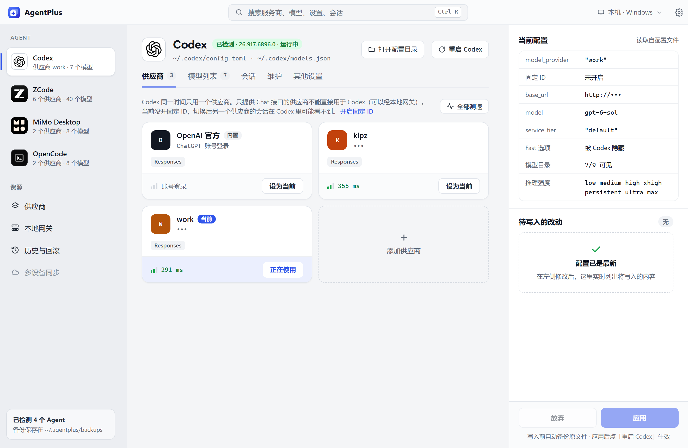
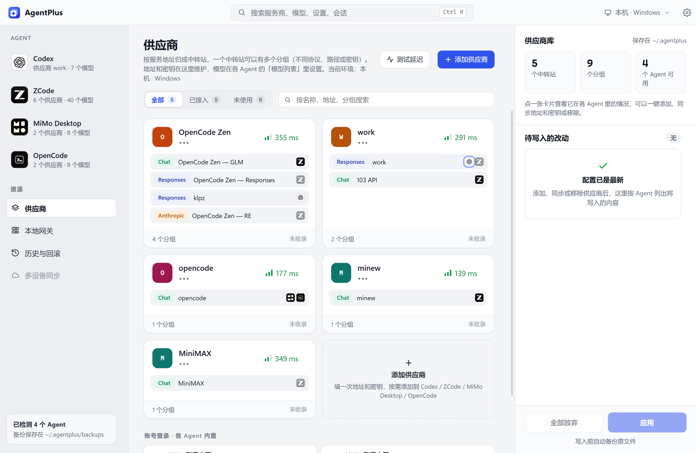
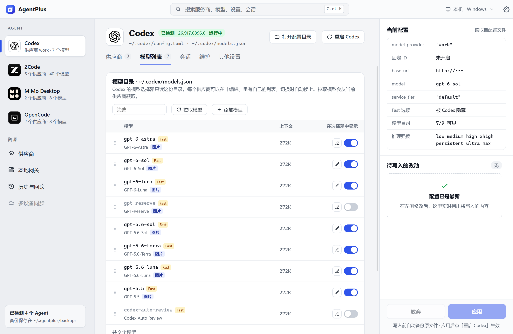
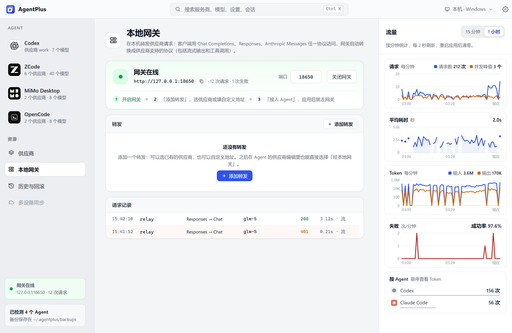

<div align="center">


# AgentPlus

**一处管理所有 AI 编程 Agent 的供应商与模型列表**

Codex · Claude Code · OpenCode · ZCode · MiMo Desktop · Gemini CLI · Qwen Code · Kimi Code 等 15 个 Agent

[](https://github.com/cnklpz/AgentPlus/releases/latest)   [](LICENSE)

简体中文 | [English](README.en.md)

<picture>
  <source media="(prefers-color-scheme: dark)" srcset="docs/images/codex-dark-zh.png">
  
</picture>

</div>

## 为什么需要 AgentPlus

每个 Agent 的配置格式都不一样：Codex 是 TOML + `models.json`，OpenCode 是 JSONC，Claude Code 靠 `settings.json` 里的环境变量……换一个中转站，就要在好几个文件里改地址、填密钥、调模型列表。

AgentPlus 把这些配置都读出来，放在一个界面里：**供应商维护一次，推送到任意 Agent**；再按 Agent 决定哪些模型出现在它的选择器里。所有改动先预览 diff，写入前自动备份，随时可以回滚。

> AgentPlus 只管「有哪些供应商、选择器里有哪些模型」，**不替你选当前用哪个模型**，这个仍然在各 Agent 里自己选。

## 界面一览

<table>
  <tr>
    <td width="50%"><p align="center"><b>供应商库</b>：按中转站归组，一眼看出每个分组接入了哪些 Agent</p></td>
    <td width="50%"><p align="center"><b>模型列表</b>：按 Agent 决定选择器里显示哪些模型</p></td>
  </tr>
  <tr>
    <td colspan="2"><p align="center"><b>本地网关</b>：三种协议互转，实时查看流量、耗时和失败率</p></td>
  </tr>
</table>

## 主要功能

| | |
|---|---|
| 🗂️ **供应商库** | 所有供应商集中维护，一键推送到选中的 Agent。内置 19 个厂商和编程套餐模板（火山方舟、智谱、Kimi、DeepSeek、百炼、MiniMax、OpenRouter……），只需填 API Key |
| 📋 **模型列表** | 按 Agent 管理选择器里显示哪些模型，可以直接拉取供应商的模型列表，支持上下文窗口等字段 |
| 🔍 **先预览、后应用** | 改动先进入待应用列表，逐条查看 diff 再写入；写完可以一键重启对应的 Agent |
| ⏪ **历史与回滚** | 每次写入前把原文件备份到 `~/.agentplus/backups/`，一键回滚 |
| 🔀 **本地网关** | `127.0.0.1` 上的 HTTP 服务，在 OpenAI Chat Completions、OpenAI Responses、Anthropic Messages 之间实时转换（含流式和工具调用），带出错熔断 |
| ⚡ **测速与测试** | 测延迟，或发一个真实的小请求，验证地址、密钥和模型是否可用 |
| 🐧 **WSL** | 目标环境可以在 Windows 和 WSL 发行版之间切换，供应商库共用 |
| 🙈 **隐私模式** | `Ctrl+Shift+H` 遮挡密钥、地址、用户名，模糊对话标题，适合截图和共享屏幕 |
| ⌨️ **命令面板** | `Ctrl+K` 搜索供应商、模型、设置和会话 |
| 🔄 **应用内更新** | 从 GitHub Releases 检查新版本，下载后校验签名再安装 |
| 🌐 **中英双语** | 界面支持简体中文和英文，默认跟随系统 |

## 支持的系统

| 系统 | 状态 | 说明 |
|---|---|---|
| Windows 11（x64） | ✅ 支持 | 主要开发和测试平台 |
| Windows 10（x64） | ✅ 支持 | 需要 WebView2，安装程序会自动补装 |
| WSL 发行版 | ✅ 作为目标环境 | AgentPlus 运行在 Windows 上，可以管理 WSL 里的 Codex CLI、OpenCode 等 |
| macOS | ⏳ 暂不支持 | 代码能编译，但 Agent 识别、重启、打开文件夹等功能还只有 Windows 实现 |
| Linux | ⏳ 暂不支持 | 同上 |

## 下载安装

到 [Releases](https://github.com/cnklpz/AgentPlus/releases/latest) 下载 `AgentPlus_<版本>_x64-setup.exe`，双击安装。

安装包没有做代码签名，首次运行时 SmartScreen 可能提示「已保护你的电脑」，点「更多信息 → 仍要运行」即可。

**更新**：AgentPlus 启动时会检查新版本，有新版本时右上角的「设置」按钮会出现小圆点。到「设置 → 通用 → 关于」查看更新说明，点「下载并安装」，AgentPlus 会校验签名、安装并自动重新打开。不想自动检查的，可以在同一处关闭。

## 支持的 Agent

未检测到安装的 Agent 会自动隐藏；装在非默认位置的，可以在「设置 → Agent 识别」里手动指定配置目录。

| Agent | 管理的配置 |
|---|---|
| **Codex**（桌面版 + CLI） | `~/.codex/config.toml`、`models.json` |
| **Claude Code** | `~/.claude/settings.json` 的 `env` |
| **OpenCode** | `~/.config/opencode/opencode.json(c)`，以及项目里的 `opencode.json` |
| **MiMo Desktop** | `~/.config/mimocode/mimocode.jsonc` |
| **ZCode** | `~/.zcode/v2/provider_config.json` |
| **Gemini CLI** | `~/.gemini/settings.json` |
| **Qwen Code** | `~/.qwen/settings.json` |
| **Kimi Code** | `~/.kimi-code/config.toml` |
| **Kilo Code** | `~/.config/kilo/kilo.json(c)` |
| **CodeBuddy** | `~/.codebuddy/models.json` |
| **Droid**（Factory） | `~/.factory/settings.json` |
| **Hermes** | HERMES_HOME 下的 `config.yaml` |
| **pi** | `~/.pi/agent/models.json` |
| **OpenClaw** | `~/.openclaw/openclaw.json` |
| **Trae** | 仅识别：自定义模型存在账号云端，AgentPlus 给出手动添加的步骤 |

### 各 Agent 的特色功能

<details open>
<summary><b>Codex</b>：会话管理、固定供应商 ID、官方模型目录</summary>

- **固定供应商 ID**：切换供应商只改同一张表，历史会话不会因为换了中转站就从 Codex 的列表里消失
- **每个供应商一份模型列表**，切换供应商时自动换上
- **会话**：浏览所有会话，查看某个会话为什么在 Codex 里看不到，把会话迁移到另一个供应商（可撤销），复制 `codex resume` 命令
- **维护**：健康检查（数据库、缺失文件、供应商不一致、日志体积等）和安全清理，清理前自动备份
- **拉取官方模型目录**：用 ChatGPT 账号登录一次，把官方的模型列表导入自己的目录
- **界面增强**：Fast 模式、完整模型名等界面补丁，通过 AgentPlus 重启 Codex 时生效
- 可以从 AgentPlus 直接重启 Codex 桌面版

</details>

<details>
<summary><b>Claude Code</b>：供应商配置档与模型角色</summary>

- 每个供应商是一份配置档，切换时写入 `settings.json` 的 `env`；手动配置过的中转也能识别并收编
- **模型角色**：分别指定默认、Opus、Sonnet、Haiku、子代理各用哪个模型
- 只支持 Anthropic 协议；其他协议的中转可以经本地网关接入
- 常用设置一键切换：关闭非必要流量、提交里的 Co-Authored-By 署名

</details>

<details>
<summary><b>OpenCode / Kilo Code</b>：项目级配置</summary>

- **项目**：给单个项目文件夹单独配置供应商、默认模型和权限，并标出哪些设置继承自全局配置
- 常用设置可视化：默认模型、`small_model`、只加载哪些供应商、会话分享、自动更新、权限（编辑 / bash / webfetch）等
- 用 `opencode auth` 登录的供应商只读显示，不会被改动

</details>

<details>
<summary><b>ZCode / MiMo Desktop</b>：桌面应用设置</summary>

- **ZCode**：模型显示顺序、每个模型的上下文规则，以及显示思考过程、记忆、最小化到托盘等设置
- **MiMo Desktop**：显示账号内置的模型（只读），技能目录兼容、托盘、语音反馈等设置
- 两者都可以从 AgentPlus 直接重启

</details>

<details>
<summary><b>其他命令行 Agent</b>：Gemini CLI、Qwen Code、Kimi Code、CodeBuddy、Droid、Hermes、pi、OpenClaw</summary>

- **Gemini CLI**：多配置档切换；系统环境变量或项目 `.env` 会覆盖设置时给出提醒
- **Kimi Code / Hermes**：只改动变化的配置块，保留原文件里的注释和格式
- **CodeBuddy**：IDE 和 CLI 共用配置，约 1 秒内热加载
- **Droid**：写入前重新读取文件，避免覆盖 Droid 运行时自己写入的改动
- **OpenClaw**：改地址或密钥时，同步更新 OpenClaw 生成的各 agent 模型文件
- **pi**：只写入已知有效的结构，避免一个字段写错导致整个文件失效
- 已有的环境变量引用（`$VAR`、`${VAR}`、`env_key` 等）会原样保留

</details>

## 开发

技术栈：[Tauri 2](https://tauri.app)（Rust，`src-tauri/`）+ React 18 + TypeScript（`src/`）+ Vite。

需要 Node.js 18+、Rust 1.88+，以及 [Tauri 的系统依赖](https://tauri.app/start/prerequisites/)（Windows 上是 WebView2 和 MSVC 生成工具）。

```bash
npm install
npm run tauri dev      # 开发模式运行
npm run tauri build    # 打包安装程序
npm run check          # 前端：类型检查 + 单元测试
```

```bash
cd src-tauri && cargo clippy --all-targets && cargo test   # 后端：lint + 单元测试
```

只改界面时可以用 `npm run dev` 在浏览器里预览，后端调用会换成演示数据。多语言和代码约定见 [CLAUDE.md](CLAUDE.md)。

<details>
<summary>目录结构</summary>

```
src/                    前端
  components/           页面与组件
  i18n/zh, i18n/en      界面文案（中文为源语言）
  api.ts                调用后端命令
  updater.ts            应用内更新
src-tauri/src/          后端
  adapters/             每个 Agent 一个适配器，负责读写它的配置文件
  gateway/              本地网关：协议转换、HTTP 服务、熔断、密钥
  sessions.rs           Codex 会话管理
  history.rs            备份与回滚
  update.rs             应用内更新
  i18n.rs               后端文案双语
```

</details>

## 参与贡献

欢迎通过 [Issues](https://github.com/cnklpz/AgentPlus/issues) 反馈问题和建议。

目前暂不接受代码贡献（Pull Request）。以后开放时，提交代码前需要签署贡献者许可协议（CLA），授权作者以 AGPLv3 以外的方式（包括商业授权）使用你贡献的代码。

## 许可证

Copyright (C) 2026 cnklpz

本项目以 [GNU Affero General Public License v3.0](LICENSE)（SPDX：`AGPL-3.0-only`）发布。修改并分发本项目，或通过网络向他人提供修改后的版本时，需要按 AGPLv3 向对方提供对应的完整源代码。

如需在不满足 AGPLv3 条款的情况下使用（例如闭源分发），请联系作者获取商业授权。
